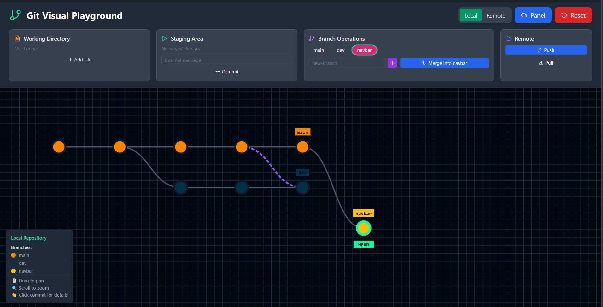

# Git Visual Playground 🎮

An interactive, visual Git learning tool that makes understanding Git concepts fun and intuitive! Built with React, this playground lets you experiment with Git operations in a safe, visual environment.



## Detailed Documentation

[](https://deepwiki.com/shivamshinde123/git-visual-playground)

## 🎯 Motivation

Learning Git can be intimidating with its command-line interface and abstract concepts. This visual playground was created to make Git learning:

- **Fun and Interactive** - Click, drag, and see immediate visual feedback
- **Intuitive** - Visual representation of commits, branches, and operations
- **Safe to Experiment** - No risk of breaking real repositories
- **Educational** - Perfect for beginners and visual learners

## ✨ Features

### 🔄 Dual Repository System
- **Local Repository** - Your working environment
- **Remote Repository** - Simulated remote server (like GitHub)
- **Easy Toggle** - Switch between local and remote views instantly

### 📁 Complete Git Workflow
- **Working Directory** - Add and modify files
- **Staging Area** - Stage files for commit
- **Commit History** - Visual commit graph with branches
- **Branch Operations** - Create, switch, and merge branches
- **Push/Pull** - Sync between local and remote repositories

### 🎨 Visual Elements
- **Interactive Commit Graph** - Pan, zoom, and click commits
- **Color-Coded Branches** - Each branch has a unique color
- **Dynamic Legend** - Shows all branches with their colors
- **Toast Notifications** - Real-time feedback for all operations
- **Commit Details** - Click any commit to see detailed information

### 🛠️ Git Operations
- ✅ Add files to working directory
- ✅ Stage/unstage files
- ✅ Create commits with messages
- ✅ Create and switch branches
- ✅ Merge branches (with merge commits)
- ✅ Push commits to remote
- ✅ Pull specific branches from remote
- ✅ Reset to initial state

## 🚀 Getting Started

### Prerequisites
- Node.js (v16 or higher)
- npm or yarn

### Installation

1. **Clone the repository**
   ```bash
   git clone <repository-url>
   cd Git-Visual-Playground
   ```

2. **Install dependencies**
   ```bash
   npm install
   ```

3. **Start the development server**
   ```bash
   npm run dev
   ```

4. **Open your browser**
   Navigate to `http://localhost:5173`

## 🎮 How to Use

### Basic Workflow

1. **Add Files** - Click "Add File" to create new files in working directory
2. **Stage Files** - Click the arrow button to move files to staging area
3. **Commit** - Add a commit message and click "Commit"
4. **Create Branches** - Type branch name and click "+" to create new branches
5. **Switch Branches** - Click on any branch button to checkout
6. **Push/Pull** - Use remote operations to sync repositories

### Advanced Features

#### Branch Management
- **Create Branch**: Enter name and click create button
- **Switch Branch**: Click on any branch button
- **Merge Branch**: Click "Merge Into" and select source branch

#### Remote Operations
- **Push**: Sends all local branches to remote
- **Pull**: Select specific branch to pull from remote
- **View Remote**: Toggle to remote view to see remote repository state

#### Visual Interaction
- **Pan**: Drag the canvas to move around
- **Zoom**: Scroll to zoom in/out
- **Select Commit**: Click any commit to see details
- **Branch Colors**: Each branch automatically gets a unique color

## 🧪 Testing

The project includes comprehensive tests covering all functionality:

```bash
# Run all tests
npm test

# Run tests with UI
npm run test:ui

# Run specific test file
npm test CoreFunctionality
```

**Test Coverage:**
- ✅ 200+ test cases
- ✅ All Git operations
- ✅ UI interactions
- ✅ Edge cases and error handling
- ✅ State management
- ✅ Component behavior

## 🏗️ Project Structure

```
src/
├── components/           # React components
│   ├── GitVisualPlayground.jsx    # Main application
│   ├── GitCanvas.jsx              # Interactive commit graph
│   ├── WorkingDirectory.jsx       # File management
│   ├── StagingArea.jsx           # Staging operations
│   ├── BranchOperations.jsx      # Branch management
│   ├── RemoteOperations.jsx      # Push/pull operations
│   └── [dialogs]/                # Modal dialogs
├── hooks/
│   └── useGitState.js            # State management hook
├── test/                         # Test files
│   ├── CoreFunctionality.test.js # Core feature tests
│   ├── Components.test.jsx       # Component tests
│   └── [other tests]
└── [config files]               # Vite, Tailwind, etc.
```

## 🎨 Technologies Used

- **React 18** - UI framework
- **Vite** - Build tool and dev server
- **Tailwind CSS** - Styling
- **Lucide React** - Icons
- **React Hot Toast** - Notifications
- **Vitest** - Testing framework
- **React Testing Library** - Component testing

## 🎯 Learning Objectives

After using this playground, you'll understand:

- **Git Workflow** - Working directory → Staging → Commit
- **Branching** - Creating, switching, and merging branches
- **Remote Operations** - Push/pull between local and remote
- **Commit History** - How commits form a graph structure
- **Merge Commits** - How merges create commits with multiple parents
- **Visual Git** - How Git operations affect the repository structure

## 🤝 Contributing

Contributions are welcome! Here's how you can help:

1. **Fork the repository**
2. **Create a feature branch** (`git checkout -b feature/amazing-feature`)
3. **Make your changes**
4. **Add tests** for new functionality
5. **Commit your changes** (`git commit -m 'Add amazing feature'`)
6. **Push to the branch** (`git push origin feature/amazing-feature`)
7. **Open a Pull Request**

## 📝 Available Scripts

- `npm run dev` - Start development server
- `npm run build` - Build for production
- `npm run preview` - Preview production build
- `npm test` - Run tests
- `npm run test:ui` - Run tests with UI

## 🐛 Known Issues

- Canvas rendering may be slow with many commits (>100)
- Some complex merge scenarios are simplified
- Mobile responsiveness could be improved

## 🔮 Future Enhancements

- [ ] Rebase operations
- [ ] Cherry-pick commits
- [ ] Stash functionality
- [ ] Conflict resolution simulation
- [ ] Export/import repository states
- [ ] Mobile-responsive design
- [ ] Keyboard shortcuts
- [ ] Undo/redo operations

## 📄 License

This project is open source and available under the [MIT License](LICENSE).

## 🙏 Acknowledgments

- Inspired by visual Git tools like GitKraken and SourceTree
- Built for educators and students learning Git
- Special thanks to the React and Vite communities

---

**Made with ❤️ for Git learners everywhere!**

*"The best way to learn Git is to see it in action"*
